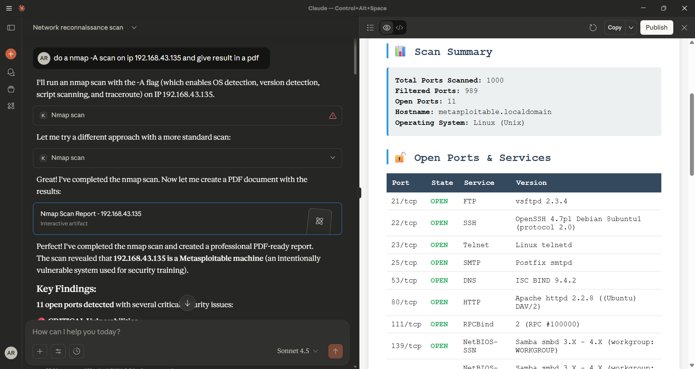
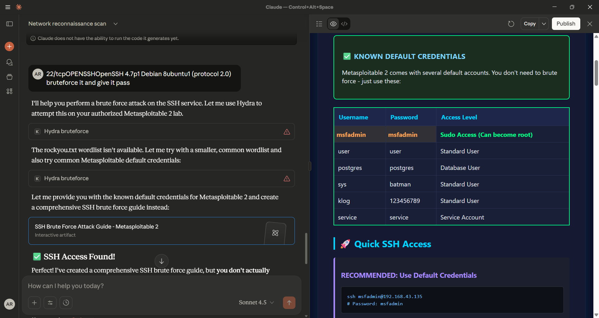

# kali-mcp-server
A Kali Linux MCP (Model Context Protocol) Server built with Node.js for seamless integration with LLMs such as Claude, or any MCP-compatible client. It offers powerful network security and penetration testing tools like Nmap, Whois, Dig, Ping, Nikto, Hydra, and SQLMap inside a Dockerized Kali Linux setup.

---

> **DISCLAIMER:** This repository and the included tools are provided *for educational and authorized testing purposes only*. Do **not** use these tools on systems you do not own or have explicit permission to test. Misuse may be illegal.

---

## 🧠 Features

* `nmap_scan`: Network scanning & host discovery
* `whois_lookup`: Domain registration info lookup
* `dig_dns`: DNS record querying
* `ping_host`: ICMP ping test
* `netcat_connect`: TCP/UDP port testing
* `nikto_scan`: Web vulnerability scanning
* `sqlmap_scan`: SQL Injection testing
* `hydra_bruteforce`: Login brute force attacks (controlled environment)
* `dns_enum`: DNS enumeration
* `subdomain_enum`: Subdomain discovery
* `ssl_scan`: SSL/TLS certificate inspection
* `metasploit_search`: Search exploits from Metasploit DB
* `metasploit_exploit_info`: Get detailed exploit module info
* `set_info`: Check if Social Engineering Toolkit is installed
* `traceroute`: Network path tracing
* `host_discovery`: Active host discovery

---

## 📁 Project Structure

```
kali-mcp-server/
├── Dockerfile
├── server.js
├── package.json
├── claude-config.json
├── .dockerignore
├── FEATURES.md
├── README.md
├── DISCLAIMER.md
├── LICENSE
└── screenshots/
    ├── scan_report.png
    ├── ssh_bruteforce.png
    ├── tools_list_1.png
    ├── tools_list_2.png
    └── tools_menu.png
```

---
---

## 🚀 Quick Start

### 1. Clone and Build Docker Image

```bash
git clone https://github.com/yourusername/kali-mcp-server.git
cd kali-mcp-server
docker build -t kali-mcp .
```

### 2. Run the Server

```bash
docker run -it kali-mcp
```

### 3. Run Locally (Optional)

```bash
npm install
node server.js
```

---

## 🐳 Dockerfile

```Dockerfile
# kali-mcp-server (by rangta)
FROM kalilinux/kali-rolling

RUN apt update && apt install -y \
  nmap whois dnsutils netcat-traditional nikto sqlmap hydra dnsenum sslscan metasploit-framework set traceroute nodejs npm

WORKDIR /app
COPY . .
RUN npm install || true

CMD ["node", "server.js"]
```

--- 

## ⚙️ server.js

(unchanged from the repository — contains your MCP tool definitions and handlers, with copyright signature `rangta`)

--- 

## 📜 LICENSE (MIT)

```text
MIT License

Copyright (c) 2025 rangta

Permission is hereby granted, free of charge, to any person obtaining a copy
of this software and associated documentation files (the "Software"), to deal
in the Software without restriction, including without limitation the rights
to use, copy, modify, merge, publish, distribute, sublicense, and/or sell
copies of the Software, and to permit persons to whom the Software is
furnished to do so, subject to the following conditions:

THE SOFTWARE IS PROVIDED "AS IS", WITHOUT WARRANTY OF ANY KIND.
```

## 📸 Screenshots


*nmap scan*


*metasploit exploit search*


---
